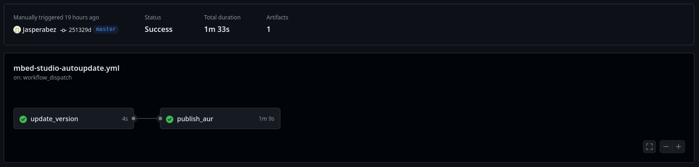

### Sidenote:
I realized it’s been five years since my last post, but oh well better late than never! Hopefully I can update this blog more consistently in the future.

# Problem
I'm the maintainer of MbedStudio (an IDE for MbedOS) on AUR (Arch User Repository). However, after moving to NixOS for my daily driver, I have neglected ensuring the package remains in sync with the latest upstream changes.

The update process itself was relatively simple, when there's a new version I'll grab the latest tarball path from upstream and update my PKGBUILD (AUR shell script). The PKGBUILD does the patching required when users install it. 

Since it is quite straightforward, I decided to automate the maintenance process using GitHub Actions. Here's how I did it.

# 1. Patching my PKGBUILD
My original PKGBUILD grabs the archive path as a source and downloads it, verify the checksum before patching and installing effectively pinning it to the "true" version as indicated.

However, for my new PKGBUILD I decided to source the official install script instead, grab the latest tarball path encoded within before downloading and patching. This ensures that the installation would work even if I stopped updating the PKGBUILD.

The caveats are that I have to skip the checksum check for the tarball as the tarball downloaded is no longer "deterministic". 

## Diff of the PKGBUILD
```diff
-ARCHIVE_PATH="/installers/release-1.4.5/1.4.5.d5955e24/linux/MbedStudio.tar.gz"
+INSTALLER_PATH="/installers/latest/linux/MbedStudio.sh"
---
- source=("$DOMAIN$ARCHIVE_PATH"
+ source=("$_archivename-official-installer.sh::$DOMAIN$INSTALLER_PATH"
---
+ prepare() {
+     cd "$srcdir"
+     # find archive path
+     ARCHIVE_PATH=$(grep -oP '(?<=ARCHIVE_PATH=).*' $_archivename-official-installer.sh)
+ 
+     # download archive
+     msg2 "Downloading... $DOMAIN$ARCHIVE_PATH"
+     curl -L -o "$_archivename.tar.gz" "$DOMAIN$ARCHIVE_PATH"
+ } 
---
- md5sums=('be7dfb7b3dfda5a35c4552d6e255e33d'
+ md5sums=('SKIP'
```

you can find the full PKGBUILDs on the [AUR repo](https://aur.archlinux.org/packages/mbed-studio-bin)

## Why do I still need Github Actions then?
For MbedStudio the inbuilt updating mechanism does not work with the patch, so to prompt users to update I'll have to manually bump the version in the PKGBUILD instead.

# 2. Setting up GitHub Repository
In order to use GitHub Actions, I created a [centralized repository](https://github.com/Jasperabez/aur) for my AUR packages and manage them using [`aurpublish`](https://github.com/eli-schwartz/aurpublish). 

aurpublish manages all the packages in subdirectories using subtrees.

## To pull package maintained
Run the following command at the root of your repo
```
aurpublish -p <package-name>
```

## To publish package to AUR
Run the following command at the root of your repo
```
aurpublish <package-name>
```

## Repo Structure
The repository structure should somewhat look like this:
```
.
├── <package_1_name>
├── <package_2_name>
├── README.md
```

# 3 - Creating the GitHub Actions Workflow
Lastly for the actual magic where I automate it! (bumping of the version)

In my repository I created a new directory called `.github/workflows` and add a new file named `mbed-studio-autoupdate.yml` to create a new GitHub Actions worflow.

## `mbed-studio-autoupdate.yml`
```yml
name: Update AUR Package - mbed-studio-bin

on:
  schedule:
    - cron: '0 0 * * *'  # Runs every day at midnight
  workflow_dispatch:  # Allows manual triggering of the workflow

jobs:
  update_version:
    runs-on: ubuntu-latest
    outputs:
      need_update: ${{ steps.check_version.outputs.need_update}}
      latest_version: ${{ steps.check_version.outputs.latest_version}}

    steps:
    - name: Checkout repository
      uses: actions/checkout@v2

    - name: Set up Git
      run: |
        git config --global user.name "${GITHUB_ACTOR}"
        git config --global user.email "${GITHUB_ACTOR}@users.noreply.github.com"

    - name: Check if update is needed 
      id: check_version
      run: |
        cd mbed-studio-bin
        # Fetch the latest version from the main website
        LATEST_VERSION=$(curl -s https://studio.mbed.com/installers/latest/linux/MbedStudio.sh | grep -oP '(?<=release-)[0-9]+\.[0-9]+\.[0-9]+')
        echo "Latest version is $LATEST_VERSION"
        
        # Fetch the current version from PKGBUILD
        CURRENT_VERSION=$(grep -oP '(?<=pkgver=)[0-9.]+' PKGBUILD)
        echo "Current version is $CURRENT_VERSION"
        
        # Determine if an update is needed
        if [ "$LATEST_VERSION" != "$CURRENT_VERSION" ]; then
          echo "need_update=true" >> "$GITHUB_OUTPUT"
        else
          echo "need_update=false" >> "$GITHUB_OUTPUT"
        fi

        # Save the version information for later steps
        echo "latest_version=$LATEST_VERSION" >> "$GITHUB_OUTPUT"
        echo "current_version=$CURRENT_VERSION" >> "$GITHUB_OUTPUT"

    - name: Update PKGBUILD
      if: steps.check_version.outputs.need_update == 'true'
      run: |
        LATEST_VERSION=${{ steps.check_version.outputs.latest_version }}
        
        cd mbed-studio-bin
        
        # Update pkgver in PKGBUILD and .SRCINFO
        sed -i "s/pkgver=.*/pkgver=$LATEST_VERSION/" PKGBUILD
        sed -i "s/pkgver=.*/pkgver=$LATEST_VERSION/" .SRCINFO
        
        # Commit and push the changes
        git add PKGBUILD .SRCINFO
        git commit -m "Update mbed-studio-bin to version $LATEST_VERSION"
        git push

    - name: upload PKGBUILD for publish_aur job 
      if: steps.check_version.outputs.need_update == 'true'
      uses: actions/upload-artifact@v4
      with:
        name: PKGBUILD
        path: |
           mbed-studio-bin/PKGBUILD 

  publish_aur:
    runs-on: ubuntu-latest
    needs: update_version 
    if: needs.update_version.outputs.need_update == 'true'
    steps:
    - name: Download PKGBUILD from update_version job 
      uses: actions/download-artifact@v4
      with:
          name: PKGBUILD 

    - name: Publish AUR package
      uses: ulises-jeremias/github-actions-aur-publish@v1
      with:
        pkgname: mbed-studio-bin 
        pkgbuild: ./PKGBUILD
        commit_username: ${{ secrets.AUR_USERNAME }}
        commit_email: ${{ secrets.AUR_EMAIL }}
        ssh_private_key: ${{ secrets.AUR_SSH_PRIVATE_KEY }}
        commit_message: v${{ needs.update_version.outputs.latest_version }}
        ssh_keyscan_types: rsa,ed25519
        update_pkgver: false

```

The workflow is divided into two jobs, one that patches the PKGBUILD on github and another that publishes it to AUR **if a patch is done**.

This is mainly done as the extension `aur-publish` takes awhile to build a container at each job invocation, wasting precious Actions minutes.

## Note:
`aur-publish` is different from `aurpublish`
- `aurpublish` is a tool that manages my repository locally which couldn't really be ran on Github Actions.
- `aur-publish` is a GitHub Actions extension that simplifies the publishing of a PKGBUILD to AUR.

# Final Thoughts
And that's pretty much it! An afternoon worth of work. 



Technically a more ideal solution would be to:
- grab the latest tarball path and update in PKGBUILD
- download the tarball, calculate checksum and update in the PKGBUILD
- build it with `makepkg` to ensure it works.

However that approach would use too much Github Actions minutes for my liking. 

Regardless, this process of automating the package management should still serve as a useful starting point for anyone attempting do something similar :)

On another note, I might try to maintain more packages in the future, either on the AUR or some Nix packages (which I'm still trying to figure out).