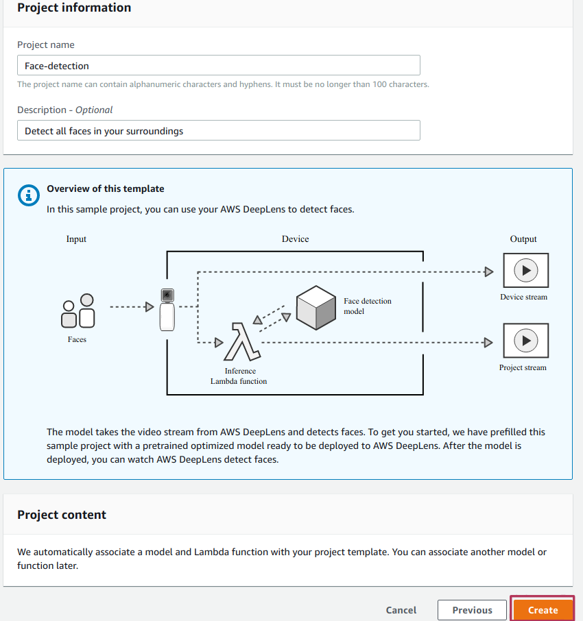
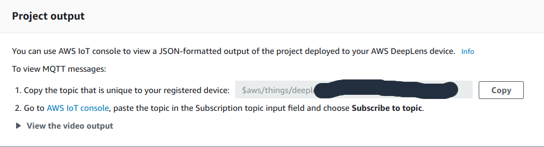
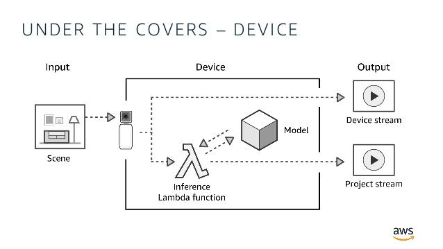

Deeplens is a cool product from AWS, so called a "deep learning enabled video camera" that let you to deploy machine learning models easily to it, and run inference on the live feed. Kind of a like a Raspberry Pi with webcam, but much powerful and easier to setup(that's if you are familiar with AWS). 

Face recognition, is a complex problem that takes several steps as mentioned in my previous post on ["Using AWS Rekognition For Face Recognition"](). 

Although we can definitely train on a specific individual face using object detection model methodologies, it is more suited for smaller datasets and doesn't scale well in terms of more faces being added into the model. 

As such we opt to instead do the face detection on the Deeplens ecosystem, then pass the found face to a dedicated face recognition system that can also be run locally on the deeplens as well or to the cloud. In this guide we pass our faces to AWS rekognition which I had well covered on how to setup face recognition on over [here]().

For this project we didn't have to store the face image taken in persistent storage as we store the Image in a binary stream before sending to AWS rekognition in bytes.


# Step 1 - Setup your Deeplens

1. Register your Deeplens to your AWS account using the [AWS Developer guide](https://docs.aws.amazon.com/deeplens/latest/dg/deeplens-getting-started-register.html), enable the SSH option when setting up internet connection.

2. Get your Deeplens ip address from your Deeplens device's page, and use that ip to SSH in using a SSH client, with the username being 'aws_cam' and password whatever you had keyed in during the setup

    

3. install the necessary dependencies for Image processing of JPEG (libjpeg) in the SSH session

    ```
    sudo apt-get install libjpeg-dev
    ```

4. Go to IAM management on AWS web console, Services > IAM (under Security, Identity, & Compliance)

    

5. Click roles, and search for **AWSDeepLensGreengrassGroupRole** and select it

    
    

6. Select **Attach policies** and search for **AmazonRekognitionReadOnlyAccess** and select it, at the bottom select **Attach policy** to finish

    

# Step 2 - create Deeplens project

1. Go to Deeplens page on AWS web console, Services > Deeplens (under Machine learning). 

    

2. Select **Projects** from the side menu, and click **Create new project**.

    

3. Choose **Use a project template** select **Face detection** and click **Next** to proceed.

    

4. On **Specify project details** enter your desired name and details before clicking **Create**

    

5. Clone this git reposistory from [here](https://github.com/Jasperabez/deeplens-rekognition-lambda)
    ```
    git clone https://github.com/Jasperabez/deeplens-rekognition-lambda.git
    ```

6. Zip it using into a .zip file using any tool(7zip, Winrar)

7. Update your lambda with it using AWS CLI, if you don't have AWS CLI follow this [guide](https://docs.aws.amazon.com/cli/latest/userguide/install-cliv2.html)

    ```
    aws lambda update-function-code --function-name deeplens-face-detection --zip-file fileb://deeplens-rekognition-lambda.zip
    ```

    make sure the zip-file path is correct


# Step 3 - deploy your project to AWS Deeplens

1. Back to the deeplens project page, select your created project

    

2. Select **deploy to device**, choose the device you've created in Step 1 and click **review**

    

    

3. After you click **Deploy** you should be redirected to your device page, and see the model deployment progress.

4. Once you see **Deployment of project Face-detection, version 1 succeeded.**, view the video stream by following [this guide](https://docs.aws.amazon.com/deeplens/latest/dg/deeplens-viewing-output.html).

5. To view MQTT messages follow these guidelines, that is listed on your Deeplens device's page

    

    message format is either '{ }' or '{name:..., confidence:..., face:...}'
    
    face represents how confidence the deeplens model think that's a face

# Interesting findings

## 1. Pip install differences in Amazon Linux vs Manjaro(python)

Following this [AWS Development Guide](https://docs.aws.amazon.com/lambda/latest/dg/python-package.html) on 'AWS Lambda Deployment Package in Python' I did a:

```
pip install --target . Pillow
```

on my folder that is holding the relevant lambda code, because I had to use the Pillow library to save the numpy array into an Image before sending it off to Rekognition.

However I ran into this Error when I deployed my project on the Deeplens

```
ImportError: cannot import name _imaging
```

After some googling there's a someone on stackoverflow that had the same issue as mine: [Lambda-Uploader: Unable to import module 'CreateThumbnail': cannot import name _imaging](https://stackoverflow.com/questions/46093874/lambda-uploader-unable-to-import-module-createthumbnail-cannot-import-name).

Apparently the solution requires me to whip up a EC2 Amazon Linux instance, ssh into it and do the pip install in there instead of doing it in a standard linux distribution due to some environment differences, which is kind of a pain as I only needed to grab that one library. 

Looking down however there's this guy who refer the Original Poster to get his libraries from a Github reposistory called: [Lambda packages](https://github.com/Miserlou/lambda-packages) by [Rich Jones](https://github.com/Miserlou) who had precompiled some commonly used python libraries in an Amazon Linux instance. So I grab the Pillow library from there instead.

It did solve the ImportError but it bought up a new error:

```
Failed to import handler function "greengrassHelloWorld.function_handler" due to exception: libjpeg.so.62: cannot open shared object file: No such file or directory
```
 
## 2. Greengrass Lambda seems to run locally or at least compiled to a local script of some form

From my prior experiences with AWS lambda, lambda code is run in the cloud on some random AWS EC2 instance. However while reading some documentation on Greegrass and Deeplens and at least in this Image from AWS:



along with the fact that same python libraries imported in the AWS lambda function could also be import locally on the Deeplens while SSH into.

```
import aws_cam
```

I had a suspicion that the lambda function is ran locally in some form or another.

Back to my previous error:

```
Failed to import handler function "greengrassHelloWorld.function_handler" due to exception: libjpeg.so.62: cannot open shared object file: No such file or directory
```

I did some googling but the results were not promising, but with my limited linux experience I hypothesize that it should be a missing dependencies on the linux distribution and along with the idea that the lambda might be run locally, I SSH into the deeplens as the user aws_cam user and ran:

```
sudo apt install libjpeg-dev
```

and surprisingly it worked!! So this seems to prove the notion of lambda being run in some form or another as I managed to fixed the error by installing the dependency **locally** on the deeplens.

But I did also note that simply doing:

```
pip install Pillow
``` 

locally on the deeplens doesn't seems to work, as I would have a module not found error. I'll have to use the method I mentioned at the ' Pip install differences in Amazon Linux vs Manjaro(python)' section. Just something to think about.

In the end however I did also copied the libjpeg.so.62 file from the

```
/usr/lib64
```

folder from my Manjaro setup and put into the root directory of the lambda function for good measure. However, didn't try out whether the lambda will work with this workaround instead of installing libjpeg locally on the deeplens.


